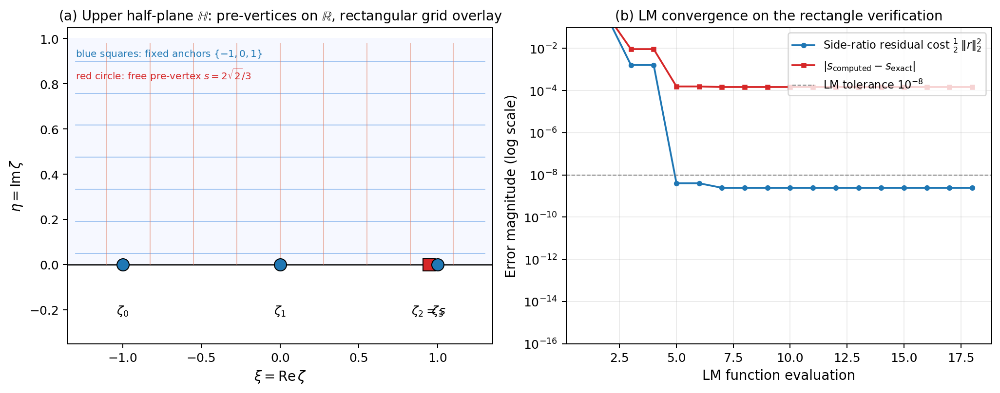
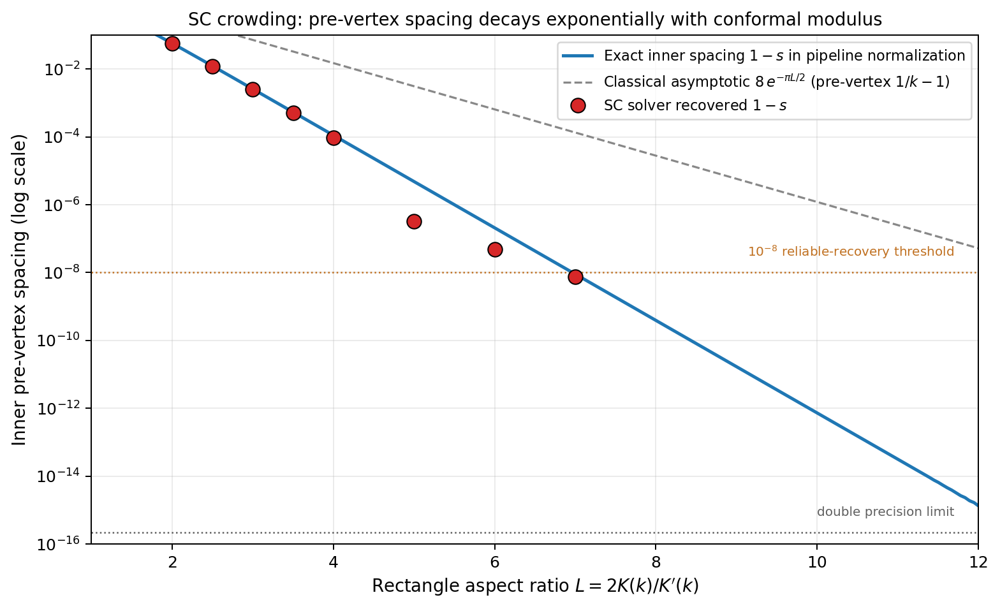
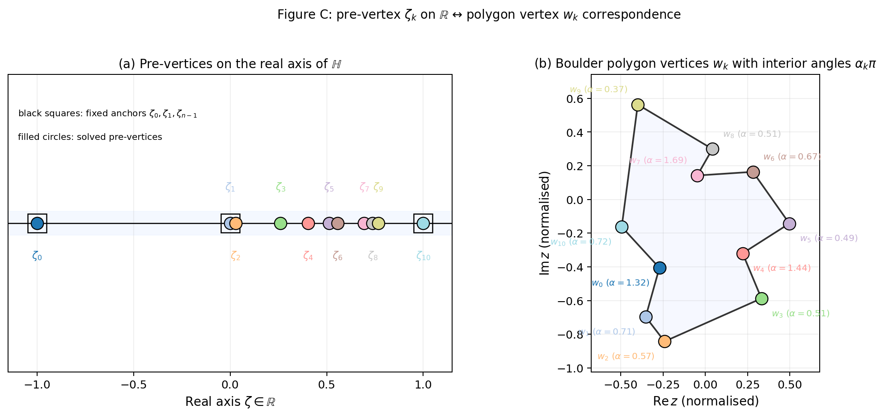
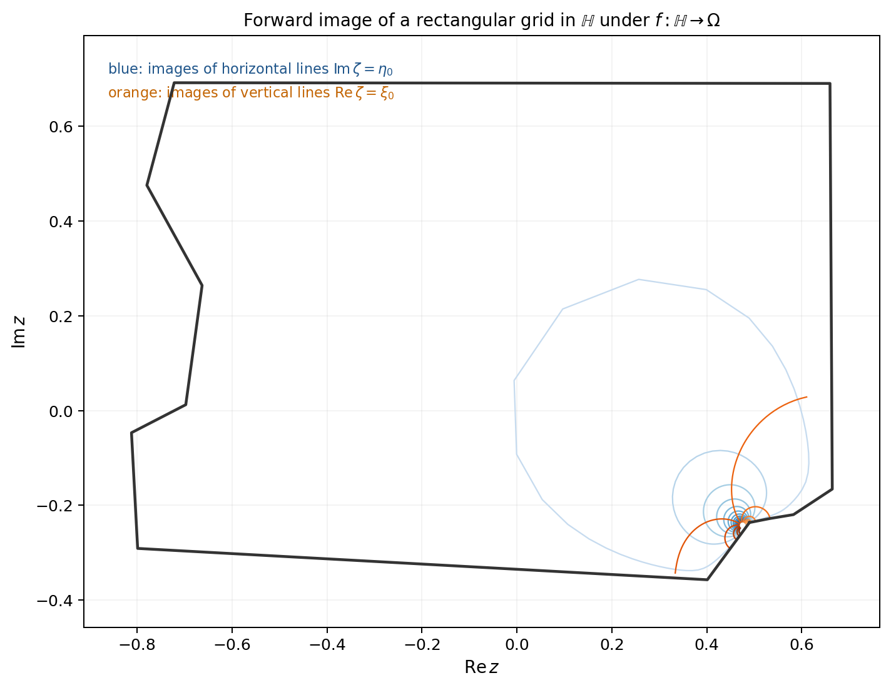
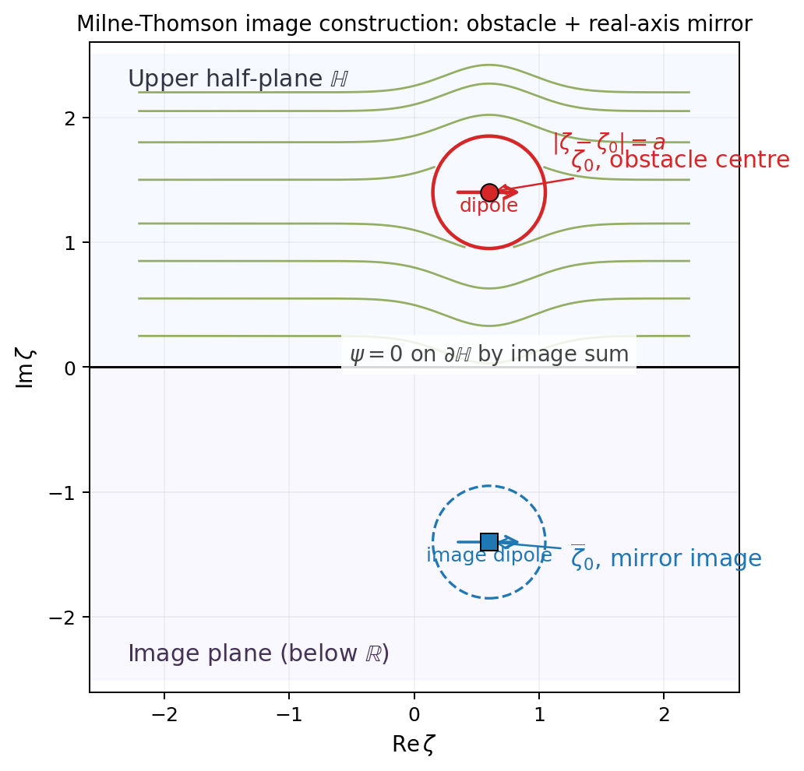
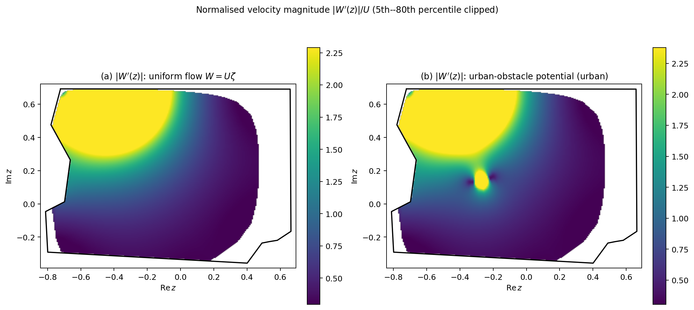
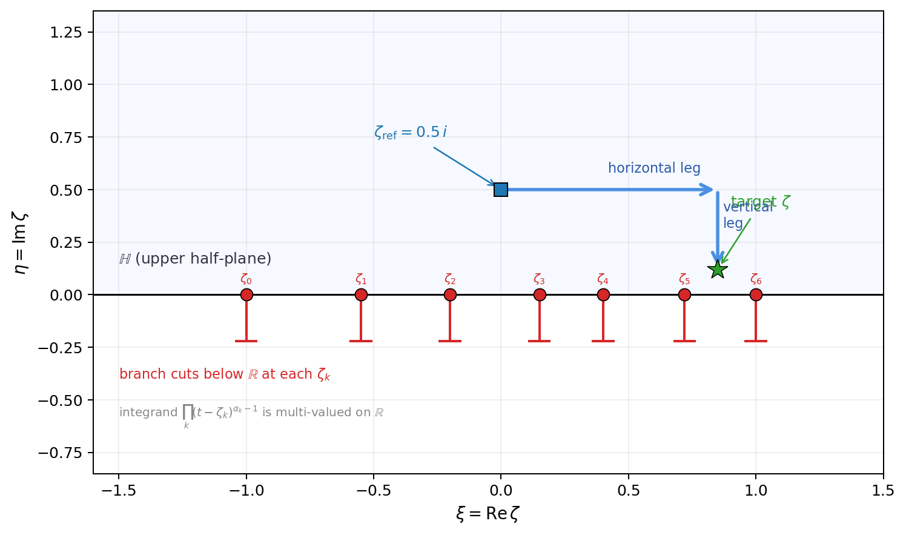
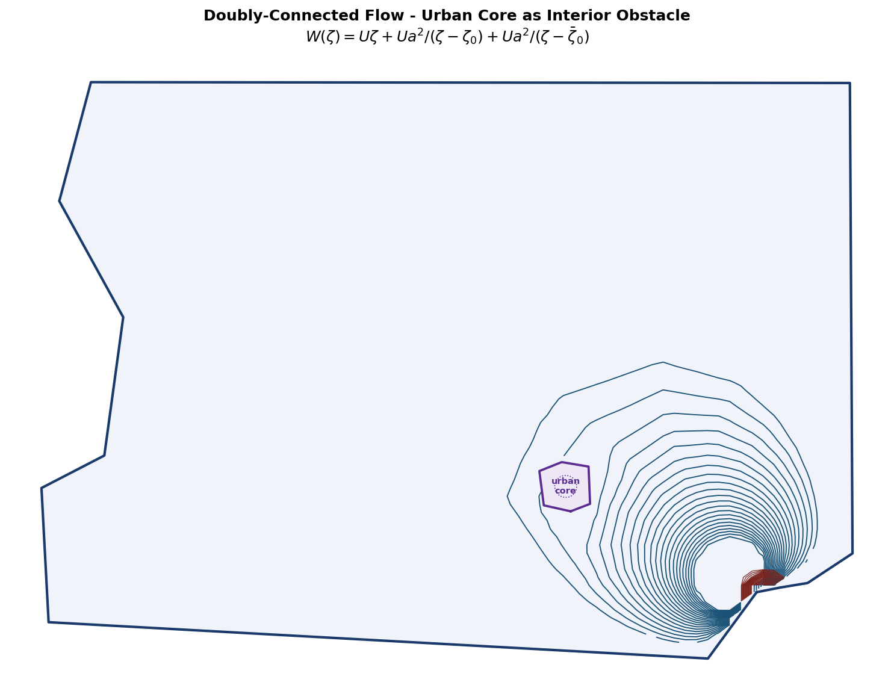

# Ideal Fluid Flow via the Schwarz-Christoffel Transformation

**Complex Variables and Applications, Spring 2026**  
Congyuan Zheng · Sophia Arany · Alexander Ingalls  
University of Colorado Boulder, Department of Applied Mathematics

---

## Overview

This project applies the **Schwarz-Christoffel (SC) conformal mapping** to simulate
ideal incompressible fluid flow inside the Boulder County, Colorado boundary polygon, with
the additional physical constraint that the velocity field is irrotational and the flow
is in steady state. Two flow models are derived and visualised, each confirmed against a
closed-form benchmark:

| Model | Potential $W(\zeta)$ | Physical meaning |
|-------|----------------------|-----------------|
| Uniform flow | $U\zeta$ | Ideal parallel flow; baseline conformal grid |
| Urban obstacle | $U\zeta + \dfrac{Ua^2}{\zeta - \zeta_0} + \dfrac{Ua^2}{\zeta - \bar\zeta_0}$ | Milne-Thomson circle-theorem obstacle |

The SC map $f : \mathbb{H} \to \Omega$ sends the upper half-plane to the Boulder County polygon,
converting analytically tractable complex potentials in $\mathbb{H}$ into streamlines and
equipotentials in the physical domain. All results use the **forward-map** approach: a
dense grid in $\mathbb{H}$ is pushed through $f$, avoiding per-pixel Newton iteration.

---

## Mathematical Framework

### Schwarz-Christoffel Mapping

For a polygon with $n$ vertices and interior angles $\alpha_k\pi$, the SC map from $\mathbb{H}$ to $\Omega$ is

$$f(\zeta) = A + C \int_{\zeta_0}^{\zeta} \prod_{k=1}^{n} (t - \zeta_k)^{\alpha_k - 1} \, dt$$

| Symbol | Meaning | Units |
|--------|---------|-------|
| $f(\zeta)$ | SC map; sends $\zeta \in \mathbb{H}$ to a point $z \in \Omega$ | normalised (dimensionless after preprocessing) |
| $\zeta = \xi + i\eta$ | complex coordinate in the upper half-plane ($\eta > 0$) | dimensionless |
| $A \in \mathbb{C}$ | translation constant | same as $z$ |
| $C \in \mathbb{C}$ | scaling-and-rotation constant | same as $z$ |
| $\zeta_k \in \mathbb{R}$ | $k$-th pre-vertex; real-axis pre-image of corner $w_k$ | dimensionless |
| $\alpha_k$ | interior angle of corner $k$ as a fraction of $\pi$; satisfies $\sum_k \alpha_k = n-2$ | dimensionless |
| $\alpha_k - 1$ | exponent; controls branch-point strength near vertex $k$ | dimensionless |
| $n$ | number of polygon vertices (11 for simplified Boulder) | — |

**Pre-vertices** $\zeta_k$ are unknowns. Möbius normalisation fixes three
($\zeta_0 = -1$, $\zeta_1 = 0$, $\zeta_{n-1} = 1$); the remaining $n - 3 = 8$ are
found by Levenberg-Marquardt nonlinear least-squares matching edge-length ratios.

---

### SC Parameter Solve

| Detail | Value |
|--------|-------|
| Parameterisation | Softmax reparameterisation, $\zeta_k \in (0,1)$; ordering and box constraints are automatic |
| Quadrature | $N = 500$-node Gauss-Legendre; convergence rate $O(N^{-1})$ at branch-point endpoints |
| Pre-vertex accuracy | $\sim 10^{-4}$ (set by plain GL at $(t-\zeta_k)^{-1/2}$ singularities) |
| LM residual (Boulder County 12-vertex) | $\|r\|_2 \approx 1.1 \times 10^{-2}$ |
| Verification (rectangle, $m(R)=2$) | exact $s = 2\sqrt{2}/3 \approx 0.94281$; recovered $0.94296$; error $1.5\times 10^{-4}$ |

---

### Method of Images

For a source/singularity at $s = a + ib \in \mathbb{H}$ ($b > 0$), the image-pair potential

$$W_{\mathrm{source}}(\zeta) = \frac{Q}{2\pi}\bigl[\log(\zeta - s) + \log(\zeta - \bar{s})\bigr]$$

has $\mathrm{Im}\,W = 0$ on $\mathbb{R}$ because $\arg(\zeta - s) + \arg(\zeta - \bar{s}) = 0$
for real $\zeta$ (conjugate arguments cancel).

| Symbol | Meaning |
|--------|---------|
| $Q > 0$ | source strength (m²/s) |
| $s \in \mathbb{H}$ | singularity location in upper half-plane |
| $\bar{s}$ | mirror image below $\mathbb{R}$; enforces $\psi=0$ on the real axis |

---

### Urban Obstacle (Milne-Thomson Circle Theorem)

The downtown core is approximated as a circular obstacle (centre $\zeta_0 \in \mathbb{H}$,
radius $a$). By the Milne-Thomson circle theorem (proved via Schwarz reflection):

$$W_{\mathrm{urban}}(\zeta) = U\zeta + \frac{Ua^2}{\zeta - \zeta_0} + \frac{Ua^2}{\zeta - \bar\zeta_0}$$

Every denominator contains the holomorphic variable $\zeta$ alone. In the third term,
the denominator is $\zeta - \bar\zeta_0$, where $\bar\zeta_0$ is a fixed complex
constant with no $\zeta$-dependence. This structure keeps $W_{\mathrm{urban}}$
holomorphic in $\zeta$.

| Symbol | Meaning | Units |
|--------|---------|-------|
| $U\zeta$ | background uniform flow | m²/s |
| $\zeta_0 \in \mathbb{H}$ | obstacle centre (pre-image of downtown Boulder centroid) | dimensionless |
| $a$ | obstacle radius in the $\zeta$-plane | dimensionless |
| $Ua^2/(\zeta - \zeta_0)$ | dipole term (circle theorem); enforces $\psi=\mathrm{const}$ on $|\zeta-\zeta_0|=a$ | m²/s |
| $Ua^2/(\zeta - \bar\zeta_0)$ | image dipole in lower half-plane; restores $\psi=0$ on $\mathbb{R}$ | m²/s |
| $\mathrm{Im}(\zeta_0)/a$ | separation ratio; Boulder County run achieves 3.96, giving $\approx 6.4\%$ approximation error | dimensionless |

Accuracy is $O\!\left((a/\mathrm{Im}\,\zeta_0)^2\right)$; exact doubly-connected SC via the
Schottky double is noted as future work.

---

## Pipeline

```bash
# Reproduce all report figures (A-G)
python scripts/build_boulder_cache.py        # solve SC once, cache result (~5 min)
python scripts/make_verification_figure.py   # Fig A: rectangle verification
python scripts/make_crowding_figure.py       # Fig B: SC crowding curve
python scripts/make_boulder_figures.py       # Figs C, D, F: prevertex/grid/velocity
python scripts/make_milne_thomson_schematic.py  # Fig E: Milne-Thomson schematic
python scripts/make_branch_cut_schematic.py     # Fig G: branch-cut path

# Full pipeline (uniform + urban obstacle)
python main.py --shapefile data/raw/tl_2025_08_county --urban --grid 80
```

| Stage | Detail | Value |
|-------|--------|-------|
| Raw polygon | TIGER/Line vertices | 2752 |
| Douglas-Peucker simplification | Adaptive tolerance | ~14 vertices |
| Extreme-angle removal | $\alpha \notin [0.35\pi,\, 1.75\pi]$ dropped | 12 vertices |
| SC parameter solve | LM residual $\|r\|_2$ | $\approx 1.1\times10^{-2}$ |
| Urban obstacle | Hardcoded downtown Boulder polygon | $9.2\ \mathrm{km}^2$ commercial core |
| Circle separation | $\mathrm{Im}(\zeta_0)/a$ | 3.96 |

---

## Figures

### Fig A: Rectangle Verification



Closed-form check: the SC pipeline is run on a target $m(R)=2$ rectangle
($k = 1/\sqrt{2}$, exact $s = 2\sqrt{2}/3 \approx 0.94281$). Panel (a) shows the
pre-vertex layout in $\mathbb{H}$. Panel (b) shows LM convergence: the side-length
residual cost plateaus near $3\times10^{-9}$ while the pre-vertex error stalls at
$\sim1.5\times10^{-4}$, both floors set by $O(N^{-1})$ Gauss-Legendre quadrature
at the branch-point endpoints.

### Fig B: SC Crowding



Pre-vertex spacing $1 - s$ as a function of rectangle aspect ratio $L = 2K(k)/K'(k)$.
The solid blue curve gives the exact inner spacing in the pipeline normalisation
$\{-1, 0, s, 1\}$, where $s = 2k/(1+k^2)$. The dashed grey line shows the classical
asymptotic $8e^{-\pi L/2}$ for the symmetric normalisation. Red circles mark spacings
recovered by the solver; they track the theoretical curve until quadrature error
dominates. The orange dashed threshold at $10^{-8}$ marks the boundary of reliable
recovery, below which the spacing lies inside the LM solver's tolerance.

### Fig C: Pre-vertex and Polygon Correspondence



Colour-matched correspondence between pre-vertices $\zeta_k$ on $\mathbb{R}$ (left)
and polygon vertices $w_k$ with interior angles $\alpha_k\pi$ (right). Black squares
mark the three Möbius-fixed anchors $\{-1, 0, 1\}$. Clustering of pre-vertices in
$[0, 0.5]$ reflects the asymmetric edge-length distribution of the simplified Boulder
boundary.

### Fig D: Conformal Grid



Rectangular grid in $\mathbb{H}$ (horizontal lines $\mathrm{Im}\,\zeta = \eta_0$ in
blue; vertical lines $\mathrm{Re}\,\zeta = \xi_0$ in orange) pushed forward through
$f$ into $\Omega$. The two families remain orthogonal throughout the polygon interior,
confirming conformality.

### Fig E: Milne-Thomson Image Construction



Schematic of the circle theorem proof via Schwarz reflection. The red circle marks
the obstacle $|\zeta - \zeta_0| = a$, with a dipole at $\zeta_0 \in \mathbb{H}$;
a dashed blue mirror circle with its image dipole at $\bar\zeta_0$ sits below
$\mathbb{R}$. Green streamlines show how the dipole sum enforces $\psi = 0$
simultaneously on $\partial D$ and $\partial\mathbb{H}$.

### Fig F: Velocity Magnitude Heatmaps



Normalised speed $|W'(z)|/U$ for uniform flow (left) and the urban-obstacle potential
(right). Colourbar clipped to the 5th–80th percentile to suppress finite-grid blow-up
at vertex branch points while keeping the flank acceleration visible. The urban-obstacle
panel shows two bright acceleration zones on the north and south flanks of the downtown
core.

### Fig G: Branch-Cut Integration Path



L-shaped integration path for the forward SC map. The horizontal leg travels at
$\mathrm{Im}\,\zeta = 0.5$, passing above the pre-vertices on $\mathbb{R}$; the
vertical leg descends at a fixed real part to the target. Both legs stay strictly
above the real axis, keeping the path entirely clear of every branch cut (which
extends downward from each $\zeta_k$ into the lower half-plane).

### Figs 1 to 4: Uniform Flow in Boulder

| Figure | File | Description |
|--------|------|-------------|
| Fig 1 | `fig1_polygon_comparison.png` | Original 2752-vertex vs. 12-vertex simplified boundary |
| Fig 2 | `fig2_streamlines.png` | Streamlines $\psi = \mathrm{const}$ under $W = U\zeta$ |
| Fig 3 | `fig3_equipotentials.png` | Equipotentials $\phi = \mathrm{const}$ |
| Fig 4 | `fig4_combined.png` | Conformal grid (streamlines + equipotentials) |

### Fig 7 — Urban-Core Obstacle



Doubly-connected flow with the Milne-Thomson obstacle. Streamlines deflect around the
purple downtown core; local acceleration on its flanks is quantified in Fig F.

---

## Project Structure

```
.
├── data/raw/                    TIGER/Line shapefile (Boulder, CO)
├── src/
│   ├── polygon.py               Load, simplify, and smooth Boulder polygon
│   ├── angles.py                Interior-angle computation and SC exponents
│   ├── sc_solver.py             SC parameter problem, GL quadrature, forward map
│   ├── sc_solver_dc.py          Milne-Thomson circle-theorem potentials
│   ├── flow.py                  Parametric streamline curves and flow grid
│   ├── terrain.py               DEM elevation (RBF) and per-vertex sources
│   ├── urban.py                 Urban-core polygon (OSM) and coordinate conversion
│   ├── roads.py                 OSM road intersections to point vortices
│   └── visualization.py         Figure generation
├── scripts/
│   ├── build_boulder_cache.py   Run SC solver once and pickle result
│   ├── make_verification_figure.py  Fig A: rectangle closed-form check
│   ├── make_crowding_figure.py      Fig B: SC crowding vs. aspect ratio
│   ├── make_boulder_figures.py      Figs C, D, F: prevertex/grid/velocity
│   ├── make_milne_thomson_schematic.py  Fig E: image-construction schematic
│   └── make_branch_cut_schematic.py     Fig G: L-shaped integration path
├── figures/                     Generated output (PNG + PDF)
├── main.py                      Full pipeline CLI
├── refs.bib                     BibTeX references
└── requirements.txt
```

---

## Setup

```bash
python -m venv .venv
source .venv/bin/activate       # macOS / Linux
# .venv\Scripts\activate        # Windows

pip install -r requirements.txt
```

### CLI Options

| Flag | Default | Description |
|------|---------|-------------|
| `--shapefile PATH` | — | TIGER/Line shapefile directory |
| `--demo` | off | Built-in hexagon domain, no data needed |
| `--urban` | off | Urban-obstacle doubly-connected flow |
| `--urban-method` | `osmnx` | `osmnx` (live OSM) or `fallback` |
| `--grid N` | 80 | Flow-grid resolution ($N \times N$) |
| `--min-vertices` | 12 | Min vertices after Douglas-Peucker |
| `--max-vertices` | 16 | Max vertices after Douglas-Peucker |

---

## References

- Ahlfors, L. V. (1979). *Complex Analysis* (3rd ed.). McGraw-Hill.
- Driscoll, T. A. & Trefethen, L. N. (2002). *Schwarz-Christoffel Mapping*. Cambridge.
- Milne-Thomson, L. M. (1968). *Theoretical Hydrodynamics* (5th ed.). Macmillan.
- Nehari, Z. (1952). *Conformal Mapping*. McGraw-Hill.
- NIST Digital Library of Mathematical Functions. https://dlmf.nist.gov/ (release 1.2.4).
- US Census Bureau. TIGER/Line Shapefiles, 2025. https://www.census.gov/geographies/mapping-files/time-series/geo/tiger-line-file.html
- Boeing, G. (2017). OSMnx: New methods for acquiring, constructing, analyzing, and visualizing complex street networks. *Computers, Environment and Urban Systems*, 65, 126–139.
